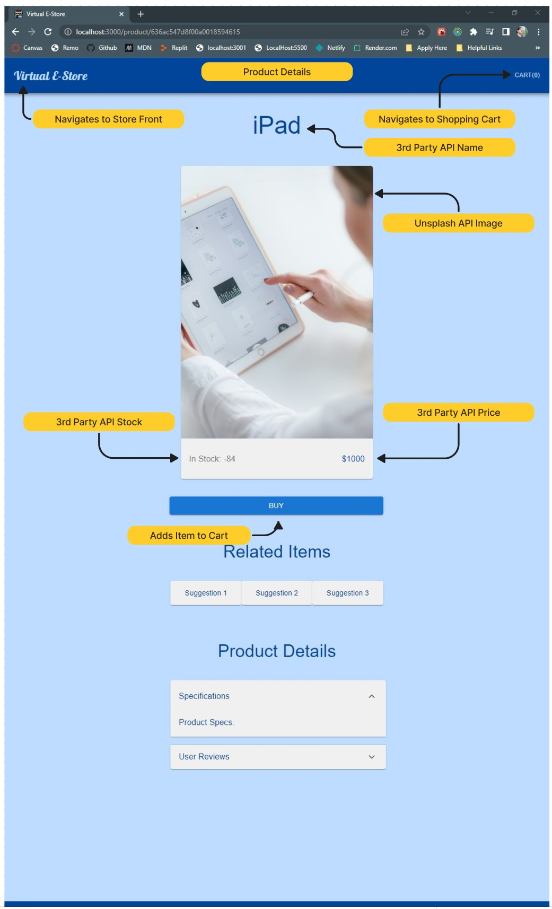

# virtual-store

## Author: Trace Dugar

## Collaborators

- Hunter Fehr

## Description

E-commerce site built using React.js, Redux toolkit, Scss, Material UI, Javascript.

## Links and Resources

[Github Repository](https://github.com/TraceDugar/virtual-store)

[Live Site](https://virtual-store-traced.onrender.com)

### Running the application

- `npm start`

### Features and Routes

- Feature 1: Categories that hold products.
- Feature 2: Products within categories.
- Feature 3: Cart.
- Feature 4: Connect to database for products and categories.
- Feature 5: Updates Inventory for the cart.
- Feature 6: Add product description page.
- Feature 7: Add Page Router.
- Feature 8: Add Image Generator for products in Categories and Description page.
- Feature 9: Add Accordion for Specs, and reviews.
- Feature 10: Add Suggestions for like items.
- Feature 11: Responsive Design for portrait and landscape orientation.
- Feature 12: Cart Scrolling list keeps items within the cart organized
- Feature 13: Cart price and Item on one line with counter.
- Feature 14: Cart Total Price is added as cart fill with more items.
- Feature 15: Popper to simulate successful order.
- Feature 16: Field for billing information (Most items lines disabled for privacy of for this purpose)
- Feature 17: Totals add and subtract themselves per total number of a Product in a cart.
- Feature 18: Grand Total Adjusts itself depending upon items in the cart.

## UML / Diagrams

## Virtual Store UML

## Store Front Diagram

## Product Details Diagram

## Shopping Cart Diagram

